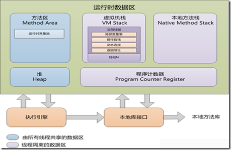

本文翻译自[Java虚拟机规范](https://docs.oracle.com/javase/specs/jvms/se8/html/jvms-2.html)
## 运行时数据区 ##

Java虚拟机定义了多种运行时数据区，在程序的执行过程中使用。这些运行时数据区中，有些在Java虚拟机启动时创建，只有当Java虚拟机退出时才销毁；其他的数据区则是每个线程一个，这些数据区随线程的创建而创建，随线程的退出而销毁。

### pc寄存器 ###
Java虚拟机支持许多线程同时执行。每个虚拟机线程都有它自己的pc（程序计数器）寄存器。任意时刻，每个Java虚拟机线程在执行单个方法的代码，这个正在被线程执行的方法叫做这个线程的当前方法。如果这个方法不是本地方法，pc寄存器包含了当前正在被执行的Java虚拟机指令的地址。如果正在被执行的方法是本地方法，Java虚拟机的pc寄存器中的值是未被定义的。Java虚拟机的pc寄存器有足够的宽度来存放返回地址或者特定平台的本地指针。

### Java虚拟机栈 ###
每个Java虚拟机线程都有一个线程私有的Java虚拟机栈，在线程创建时一同创建。Java虚拟机栈存储**栈帧**。一个虚拟机栈可以类比传统编程语言（如C语言）中的栈。它持有局部变量和中间结果，在方法调用和返回中发挥作用。因为Java虚拟机栈除了压栈和出栈操作外，绝不会被直接操纵，所以栈帧也许是在堆上分配。Java虚拟机栈的内存不需要是连续的。

*在Java虚拟机规范的第一版中，Java虚拟机栈曾被叫做Java栈。*

本规范允许Java虚拟机栈大小固定或者随计算过程动态扩张和收缩。如果Java虚拟机栈是固定大小的，每个Java虚拟机栈的大小可能在该栈被创建时独立指定。

*Java虚拟机的特定实现，在Java虚拟机栈的大小是动态伸缩时，可能会提供程序员或用户控制Java虚拟机栈的初始大小和最大值最小值的手段。*

下面是一些与Java虚拟机栈相关的异常情形：
- **如果线程要求一个超过Java虚拟机栈大小限制的Java虚拟机栈，Java虚拟机抛出StackOverflowError**.
- **如果Java虚拟机栈是可以动态扩展的，且尝试扩展时由于内存不足无法满足该扩展，或者内存不足导致无法为一个新线程创建一个初始的Java虚拟机栈时，Java虚拟机抛出OutOfMemoryError**.
### 堆 ###
Java虚拟机有一个被所有Java虚拟机线程所共享的堆。堆是所有类的实例和数组的内存分配的运行时数据区。

堆在Java虚拟机启动时创建。堆中对象存储被一个自动存储管理系统（称作垃圾搜集器）回收，对象绝不会显式地回收。内存管理的技术需根据实现者的系统要求来选择，

Java虚拟机不假设特定类型的自动存储管理系统。堆可以是固定大小的，也可以是会随着计算过程的需求扩展，而当更大的堆变得不必要时进行压缩。为堆分配的内存空间不要求是连续的存储空间。

*Java虚拟机的特定实现可以提供让用户控制堆的初始大小和最大值最小值的手段，当在该实现中堆的大小是能够动态扩展和收缩时。*

下面是与堆相关的异常情形：
- **如果计算过程要求更大的堆空间，无法通过自动存储管理系统来获得，Java虚拟机会抛出OutOfMemoryError.**
### 方法区 ###
Java虚拟机有一个被所有Java虚拟机线程所共享的方法区。方法区可以类比传统语言的编译代码的存储区域或者类比操作系统进程的“text”区段。它存储每个类的结构，诸如运行时常量池，字段，方法数据，方法和构造器的代码，包括那些在类和实例及接口初始化时使用的特殊方法。

方法区在虚拟机启动时创建。虽然在逻辑上，方法区属于堆的一部分，简单的实现也许是选择不让垃圾回收器回收或者压缩它。本规范不指定方法区的位置或管理编译代码的政策。方法区可以是大小固定的也可以是能够随着计算的需要而扩展，当大的方法区变得不需要时压缩。方法区的物理内存空间不需要是连续的。

*Java虚拟机的特定实现可以提供让用户控制方法区的初始大小和最大值最小值的手段，当在该实现中方法区的大小是能够动态扩展和收缩时。*

下面是与方法区有关的异常情形：
- **如果方法区的内存大小无法满足一个内存分配请求时，Java虚拟机抛出OutOfMemoryError.**
### 运行时常量池 ###
运行时常量池是的类或接口在class文件中的constant_pool表的运行时代表。它包含了几种常量，从编译时就知道的数字字面量到需要在运行时解析的方法和字段引用。运行时常量池的作用类似与传统编程语言中的符合表，尽管它比一个典型的常量表包含更大范围的数据。

每个运行时常量池被分配在Java虚拟机的方法区。一个类或接口的运行时常量池在这个类或者接口被创建时由Java虚拟机构建。

下面是与一个类或接口的运行时常量池的构建相关的异常情形：
- **当创建一个类或接口时，如果运行时常量池的构建需要的内存无法从Java虚拟机的方法区获得满足时，Java虚拟机抛出OutOfMemoryError.**
### 本地方法栈 ###
Java虚拟机的一个实现也许会使用传统的栈，俗称“C栈”，来支持本地方法（采用除Java编程语言之外的语言写的方法）。本地方法栈也可能被Java虚拟机指令集的解释器的一个某种语言（例如C语言）的实现使用。Java虚拟机的实现如果不能加载本地方法，且它们自身不依赖传统的栈，则不需要提供本地方法栈。如果提供了本地方法栈，典型地实现是，当线程被创建时，每个线程会分配一个本地方法栈。

本规范允许本地方法栈大小固定或者随程序计算过程的需要而动态地扩展与收缩。如果本地方法栈是固定大小的，那么每个本地方法栈可以在它创建时独立地指定大小。

*Java虚拟机的特定实现会提供程序员或用户控制本地方法栈的初始大小以及最大值和最新值的手段 ，当在该实现中本地方法栈的大小是能够动态扩展和收缩时。*

下面是与本地方法栈相关的异常情形：
- **如果一个线程中的计算需要一个超过本地方法栈大小限制允许的本地方法栈，Java虚拟机抛出StackOverflowError.**
- **如果本地方法栈能够动态地扩展，其在尝试扩展的时候由于内存空间不足的影响无法扩展，或者由于内存不足，无法为一个新的线程创建一个初始的本地方法栈时，Java虚拟机抛出OutOfMemoryError.**

### 帧 ###
*帧*用来存储数据和局部结果，也用来执行动态链接，方法返回值或者分发异常。

帧在一个方法被调用时创建，在它的方法调用完成时销毁，无论是正常完成还是突然完成(方法抛出一个未被捕获的异常)。帧在创建这个帧的线程的Java虚拟机栈上分配内存。每个帧都有它自己的局部变量表，它自己的操作数栈，和一个指向当前方法所在类的运行时常量池的引用。

*帧也可能被扩展，带有一些与特定实现相关的信息，例如调试信息。*

局部变量表数组的大小和操作数栈的大小在编译时确定，和与这个帧关联的方法的代码一起提供。因此帧的数据结构的大小只依赖Java虚拟机的实现，这些数据结构的内存可以在方法调用时一起分配。

在一个给定的线程控制中，任一时刻，只有一个帧——当前正在执行的方法的帧，是活跃的。这个帧被称作当前帧，它对应的方法叫做当前方法。当前方法所定义的类是当前类。对局部变量表和操作数栈的操作典型地引用当前帧。

当一个方法调用另一个方法或者帧所对应的方法完成时，该帧不再是当前帧。当一个新方法被调用时，一个新的帧被创建并当控制转移到新方法时成为当前帧。方法返回时，当前帧将方法调用的结果返回给前一个帧，如果栈中还有帧的话。当前帧随即被丢弃，前一个帧成为当前帧。

注意帧由一个线程创建并局部于那个线程，不能被任何其他的线程引用。

### 局部变量表 ###
每个帧包含一个变量数组，称作局部变量表。一个帧的局部变量数组的大小在编译时被确定并和这个帧关联的方法的代码一起，在类或者接口的二进制表示中被提供。

一个单个的局部变量可以存储boolean,byte,char,short,int,float,reference或者返回地址类型的值。一对局部变量可以存储long或double类型的值。

局部变量表通过索引来寻址。第一个局部变量的索引为0。当且仅当整数的值位于0和局部变量数组的大小减去一之间时，该整数才视作对局部变量数组的一个索引。

long或double类型的值占据两个连续的局部变量。这种类型的值只能通过较小的索引来寻址。例如，一个存储在局部变量数组的n索引处的double类型的值实际上占有局部变量表的索引n和n+1这两个位置，然而，索引n+1处的局部变量不能被读取，它可以被写入，但是，这么做将导致索引n处的局部变量无效。

Java虚拟机不要求n是偶数的。更直观的说法，在局部变量表中，long和double类型的值不需要64位对齐。Java虚拟机的实现者可以自由决定采用合适的方式使用为long和double类型的值所保留的两个局部变量来表示这种值。

java虚拟机使用局部变量表来在方法调用时传递参数。在类的方法被调用时，所有的方法参数被传递进局部变量表中，从局部变量0开始的连续的局部变量中。在实例的方法被调用时，局部变量0总是用来传递指向该正被调用的实例方法的对象的引用（Java编程语言中的this)，所有其他的参数紧接着传递进从局部变量1开始的连续的局部变量中。

### 操作数栈 ###
每个帧包含了一个后进先出的称作操作数栈的栈。一个帧的操作数栈的最大深度在编译时确定，并和该帧所关联的方法的代码一起提供。

当上下文明确时，我们有时候会简单地把当前帧的操作数栈称为操作数栈。

当帧创建时，操作数栈是空的。Java虚拟机提供了指令来加载常量或局部变量表中的值或字段到操作数栈。其他的Java虚拟机指令从操作数栈取出操作数，对操作数进行运算，然后将结果放回操作数栈。操作数栈也被用来准备传递给方法的参数或者接收方法结果。

例如，iadd指令将两个int值一起相加。它要求这两个被相加的int值必须是位于操作数栈栈顶的前两个值，由前面的指令存放到那的。这两个int值从操作数栈中弹出。它们被相加，然后它们的和被放回到操作数栈。子计算过程可能被嵌套在操作数栈上，产生可以被外部计算使用的值。

操作数栈上的每个条目可以持有任意Java虚拟机类型的值，包括long或double类型的值。

操作数栈上的值必须被适合它们类型的操作所操作。例如，将两个int类型的值压入栈，紧接着将它们当做long类型的值来对待，或者将两个float类型的值入栈，紧接着使用iadd指令将它们相加。有很小数目的Java虚拟机指令在运行时数据区上操作时作为原生的值而不考虑它们特定的类型；这些指令是以它们不能用来修改或者拆分单个的值的方式来定义的。这些针对操作数栈上的操作的限制通过类文件验证来强制保证的。

在任一时刻，一个操作数栈有一个关联的深度，long或double类型的值贡献两个单位的深度，其他类型贡献一个单位。

